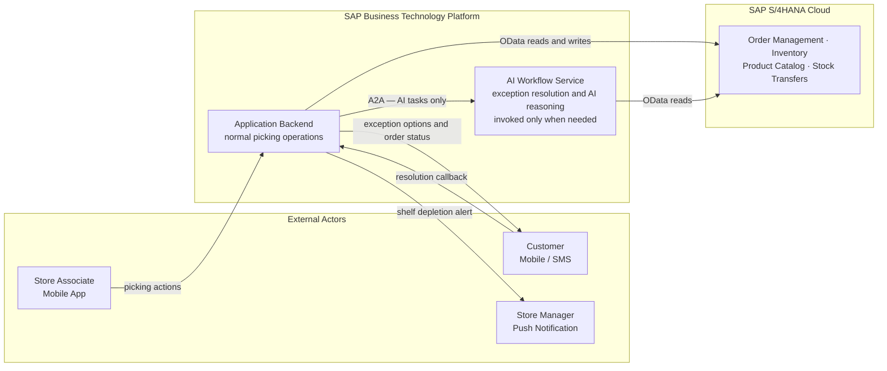
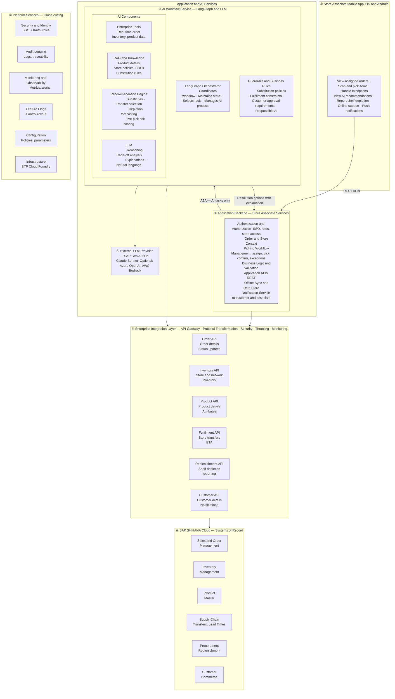
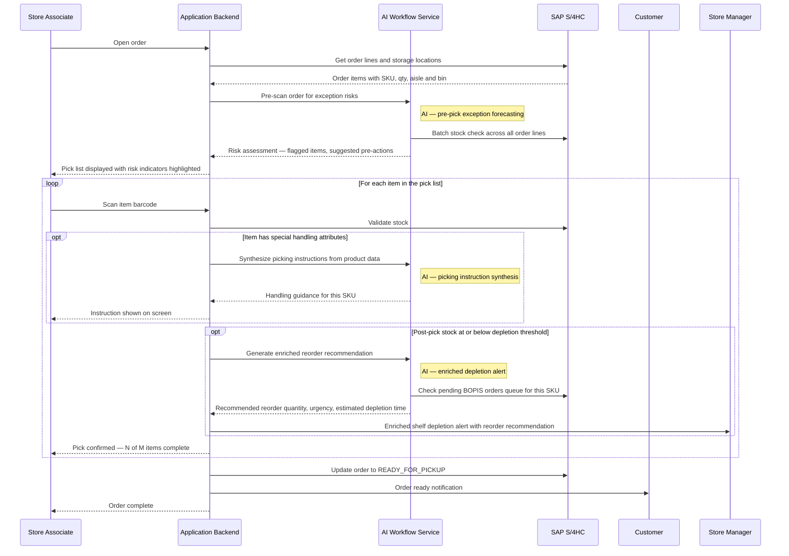
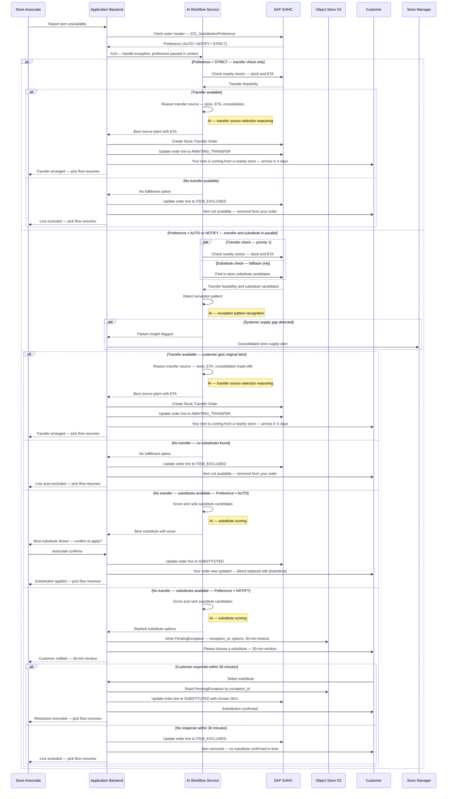
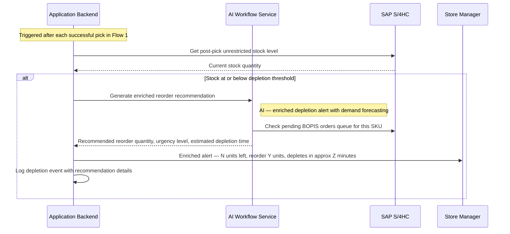
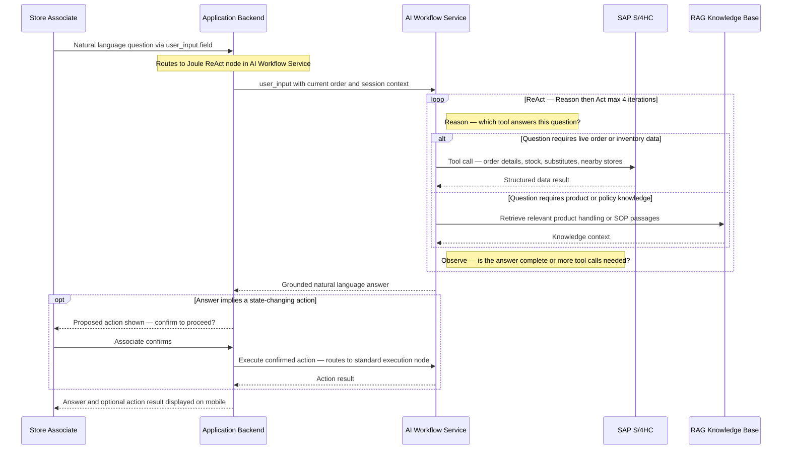

# Store Associate Agent (SAA)
## Technical Design — Design Challenge Submission

**Use Case**: Buy Online, Pick Up In Store (BOPIS) — Retail Order Picking
**Domain**: Retail Store Operations · SAP S/4HANA Cloud · SAP BTP
**Submission Date**: 2026-09-23

---

## Table of Contents

1. [System Architecture](#1-system-architecture)
   - 1.1 System Context (L1)
   - 1.2 Component Architecture (L2)
   - 1.3 Flow Blueprints (L3)
   - 1.4 AI Touchpoints Summary
2. [Architecture Decisions](#2-architecture-decisions)
3. [A2A Message Contract](#3-a2a-message-contract)
4. [Agent State Machine](#4-agent-state-machine)
5. [Tool Inventory](#5-tool-inventory)
6. [AI Design](#6-ai-design)
7. [SAP Integration](#7-sap-integration)
8. [Multi-Tenancy and Security](#8-multi-tenancy-and-security)
9. [Observability](#9-observability)
10. [Error Handling](#10-error-handling)
11. [Deployment](#11-deployment)

---

## 1. System Architecture

### 1.1 System Context (L1)

Who interacts with the system, where the boundary sits, and what external systems it depends on. The key architectural split: the **Application Backend** handles all deterministic picking operations; the **AI Workflow Service** is invoked only when AI reasoning is needed.

**Key observations:**
- The Application Backend is the only component that writes to SAP S/4HC. The AI Workflow Service is read-only with respect to the system of record.
- The customer never calls the AI Workflow Service directly. All external actors communicate with the Application Backend.
- The AI Workflow Service is called by the Application Backend via A2A only for tasks that exceed deterministic logic: exception resolution, pre-pick forecasting, picking instructions, substitute scoring, and depletion recommendations.

---

### 1.2 Component Architecture (L2)

Seven-layer structure from client to platform. Application Backend and AI Workflow Service are co-deployed on SAP BTP but maintain a clean service boundary.

**Layer responsibilities:**

| Layer | What it owns |
|-------|-------------|
| ① Mobile App | User interaction, offline cache, push receipt, barcode scanning |
| ② Application Backend | Deterministic picking logic, S/4HC mutations, HITL state management, customer and manager notifications |
| ③ AI Workflow Service | LLM orchestration, RAG retrieval, AI recommendations, exception pattern detection |
| ④ LLM Provider | SAP Gen AI Hub Claude Sonnet |
| ⑤ Integration Layer | Protocol translation, API gateway, throttling, security token validation |
| ⑥ SAP S/4HC | All domain data: orders, inventory, product catalog, stock transfers |
| ⑦ Platform Services | Shared cross-cutting concerns: identity, audit, monitoring, configuration |

---

### 1.3 Flow Blueprints (L3)

#### Flow 1 — Standard Order Picking

---

#### Flow 2 — Item Unavailability Exception (Tiered Resolution)

---

#### Flow 3 — Shelf Depletion Alert (Fully Autonomous)

---

#### Flow 4 — Joule Conversational Assistant

Associate asks a natural language question at any point during the picking session. The AI Workflow Service runs a ReAct loop, calling live SAP tools or the RAG knowledge base, and returns a grounded answer. Write actions require explicit associate confirmation before execution.

---

### 1.4 AI Touchpoints Summary

| # | AI Use Case | Flow | Trigger | AI Reasoning Task | Status |
|---|-------------|------|---------|-------------------|--------|
| 1 | Pre-pick exception forecasting | Flow 1 — start | Order opened | Batch-scan all lines against live stock; flag high-risk items; suggest pre-emptive actions | Added |
| 2 | Picking instruction synthesis | Flow 1 — per scan | Item scanned | Retrieve product attributes from RAG; synthesise actionable handling instruction for the associate | Added |
| 3 | Substitute scoring | Flow 2 — exception | Item unavailable | Rank candidates by category match, unit equivalence, price proximity, and compatibility rules; return top 2–3 with rationale | Original |
| 4 | Transfer source selection reasoning | Flow 2 — exception | Transfer feasibility confirmed | Reason across candidate stores on distance, stock, transfer reliability, consolidation trade-offs | Added |
| 5 | Order-level exception pattern recognition | Flow 2 — exception | Each exception raised | Detect systemic supply gap vs. isolated unavailability; escalate consolidated insight if pattern found | Added |
| 6 | Enriched depletion alert | Flow 3 / Flow 1 side-step | Depletion threshold breached | Query BOPIS demand queue; forecast depletion time; recommend reorder quantity and urgency | Added |
| 7 | Customer timeout escalation recommendation | Flow 2 — timeout | No response in 30 min | Reason on order value, item count, pickup window, and ETA to recommend hold vs. unfulfilled | Planned |
| 8 | **Joule conversational assistant** | **Flow 4 — cross-cutting** | **Associate natural language question** | **ReAct loop: reason → select tool → call live SAP data or RAG → observe → answer. Write actions require confirmation gate before execution** | **Active** |

---

## 2. Architecture Decisions

### Decision 1: Separate Application Backend from AI Workflow Service

- **What**: Deterministic picking operations live in the Application Backend. AI reasoning is handled exclusively by a separate AI Workflow Service, invoked via A2A.
- **Consideration**: This keeps normal picking latency predictable — a scan confirmation never waits for LLM inference. The AI service can be scaled independently and updated without touching picking logic.
- **Limitation**: Cross-service calls on the exception path add latency. A2A overhead and LLM inference time must be within acceptable bounds (target: < 3 seconds for exception resolution options). Pre-pick forecasting adds a call at order open — must degrade gracefully if the AI service is slow or unavailable.
- **Assumption**: The AI Workflow Service is deployed on the same BTP subaccount, making A2A calls an internal network hop rather than an internet-crossing call.

---

### Decision 2: LangGraph StateGraph as the orchestration framework

- **What**: The AI Workflow Service uses LangGraph's StateGraph to manage the exception resolution workflow — parse input → fan-out parallel checks → score → route → notify or execute.
- **Consideration**: LangGraph provides explicit, inspectable node transitions. Every state transition is logged, replay is possible, and conditional routing is coded deterministically rather than delegated to the LLM. This makes the agent's behavior auditable.
- **Limitation**: LangGraph requires careful node design to avoid state pollution between concurrent invocations (e.g., two associates raising exceptions on the same order simultaneously). Each invocation must be isolated by `exception_id`.
- **Assumption**: The LangGraph StateGraph runs in a stateless BTP Cloud Foundry application instance. All durable state is externalised to S3 and S/4HC.

---

### Decision 3: Async HITL via Object Store

- **What**: When the customer exception notification is sent, the resolution state is written to S3 as a `PendingException` record keyed by `exception_id`. The agent returns immediately. When the customer responds (up to 30 minutes later), the Application Backend reads the state by ID and resumes.
- **Consideration**: The 30-minute window rules out holding a server connection or in-memory state. Object Store is durable, low-cost, and accessible across all application instances.
- **Limitation**: If S3 is unavailable at callback time, the customer response cannot be processed. The associate would need to manually handle the exception.
- **Assumption**: BTP Object Store is available with sufficiently high durability for a 30-minute window. A missed response is a degraded experience, not a data loss event — the order line remains in its pre-exception state.

---

### Decision 4: RAG knowledge layer for product and policy content

- **What**: The AI Workflow Service includes a RAG (Retrieval-Augmented Generation) component containing product handling instructions, store SOPs, and substitution compatibility rules.
- **Consideration**: This content exists in unstructured form (policy documents, product data sheets) and cannot be queried via S/4HC OData. RAG enables the AI to generate context-specific picking instructions and apply soft compatibility rules (e.g., allergen awareness) that are not encoded in the material master.
- **Limitation**: The RAG knowledge base must be populated, maintained, and kept current by the customer's operational team. Stale or sparse content degrades instruction quality. The initial knowledge base population is a deployment prerequisite.
- **Assumption**: The customer has existing product documentation and store SOPs in a format that can be chunked and indexed (PDF, Word, structured text). If this content does not exist, the picking instruction synthesis feature provides limited value.

---

### Decision 5: Three-way parallel availability check

- **What**: When an item is reported unavailable, all three availability checks (nearby store stock, in-store substitutes, global availability) run concurrently using async fan-out.
- **Consideration**: Sequential checks would impose additive latency. In the exception path, the associate and customer are waiting. Running checks in parallel collapses the latency to the slowest of the three, not the sum.
- **Limitation**: All three OData calls count against the S/4HC API rate limit simultaneously. Under high concurrent exception load (many associates raising exceptions at the same time), this could saturate the API gateway throttle.
- **Assumption**: The customer's S/4HC tenant API rate limits are sufficient for the expected peak concurrent exception volume. Rate limit monitoring is included in the observability design.

---

### Decision 6: OAuth2 User Token Exchange for principal propagation

- **What**: The store associate's BTP session token is exchanged for an S/4HC bearer token via BTP Destination Service OAuth2 User Token Exchange. All S/4HC mutations carry the associate's identity.
- **Consideration**: Using a shared service account would make audit trails in S/4HC unintelligible — every order mutation would appear to come from the same user. Per-associate identity is essential for compliance and post-incident investigation.
- **Limitation**: Requires each associate to have a corresponding user account in S/4HC with appropriate authorisation roles. This is an operational dependency on the customer's S/4HC user management.
- **Assumption**: Associate identities are provisioned in S/4HC and the BTP IDP trust is configured correctly. A dedicated service account is available as fallback for automated background tasks (e.g., pre-pick forecasting) that do not correspond to a specific associate session.

---

### Decision 7: Key User Extensibility for order line status tracking

- **What**: Custom fields (`ZZ1_LineStatus`, `ZZ1_SourcePlant` on order item; `ZZ1_OrderStatus` on order header) are added to SAP S/4HC using RAP-based Key User Extensibility — not custom Z-tables or BAdI modifications.
- **Consideration**: Key User Extensibility extensions appear automatically in the standard OData API surface. This avoids custom service development and keeps the extension upgrade-safe across S/4HC releases.
- **Limitation**: Field type, length, and validation constraints are limited by the extensibility framework. Complex business logic cannot be embedded in Key User Extensibility fields. The extensions must be created once by an S/4HC administrator before the agent can be deployed.
- **Assumption**: The S/4HC instance supports Key User Extensibility for Sales Order objects on the customer's release level.

---

### Decision 8: Joule reuses the existing tool inventory — the ReAct layer is additive, not a parallel stack
- **What**: The Joule ReAct agent runs within the same AI Workflow Service LangGraph graph and accesses the same 11 tool functions used by the deterministic exception and picking flows. The LLM decides dynamically which tools to invoke and in what order, based on the associate's question. There is no separate Joule tool layer, no separate S/4HC connection, and no separate RAG index.
- **Consideration**: This design means Joule is almost free to add once the core tool layer is built. Every tool already tested for the exception flow (substitute finder, stock checker, nearby store lookup) is immediately available for conversational use. The architectural pattern — build the tool layer first, then build reasoning agents on top — is a deliberate choice that makes the system composable and extensible at low incremental cost.
- **Limitation**: The ReAct loop must be bounded. Without a max_iterations cap and a per-invocation timeout, a complex question (e.g., "find me the best substitute for every unavailable item in this order") could trigger 10+ tool calls and far exceed the mobile UX latency target. The cap (max 4 iterations, 2.5-second timeout) is enforced in the orchestrator and the system prompt. Langfuse tracing on the Joule node captures every iteration for offline evaluation.
- **Assumption**: Joule conversational context is maintained in the LangGraph `messages` state list for the duration of the associate's session. There is no cross-session conversational memory — if the session ends, conversation history is lost. This is acceptable for a store picking session context where each shift starts fresh.

---

### Decision 9: Transfer-universal, preference governs substitutes only

- **What**: `ZZ1_SubstitutionPreference` governs substitute decisions only — it does not gate transfer eligibility. Transfer is checked for **all** preferences because it delivers the customer's original item from a different source; the customer's substitution stance is irrelevant to that decision. `parallel_exception_check` reads the preference and adjusts the fan-out: STRICT → transfer check only; AUTO/NOTIFY → transfer check and substitute check in parallel. `route_exception` then routes in priority order: (1) transfer available → `execute_transfer` regardless of preference; (2) STRICT, no transfer → `auto_exclude`; (3) AUTO, no transfer, substitutes found → `associate_confirm_substitute`; (4) NOTIFY, no transfer, substitutes found → `send_exception_notification`; (5) no options, any preference → `auto_exclude`. AI confidence scoring ranks substitute candidates for presentation; it does not determine the authorization path.
- **Consideration**: The prior design applied the preference gate before all availability checks, which meant a STRICT customer could lose an item that was perfectly transferable from a nearby store — a needlessly bad outcome for both the customer and the retailer. Separating the transfer decision from the substitution preference removes this false constraint. From the customer's perspective, a transfer delivers what they ordered; a substitute is a different product entirely. These are fundamentally different operations, and a "no substitutes" preference should never block the option that gives the customer exactly what they ordered.
- **Limitation**: The AUTO path places trust in the associate's confirmation tap. In a noisy or high-pressure store environment, associates may confirm a substitute without examining it carefully. This can be partially mitigated by requiring the associate to scan the substitute's barcode as the confirmation action, rather than just tapping "Yes."
- **Assumption**: `ZZ1_SubstitutionPreference` is populated at order placement. If absent, the agent defaults to NOTIFY (substitute path requires customer notification; transfer is still attempted regardless). Transfer feasibility requires `ZZ1_TRANSFER_LEADTIME` to be configured for the relevant plant pairs.

---

## 3. A2A Message Contract

The agent exposes a single A2A endpoint that handles all four actions from the mobile app and the customer callback.

### Actions

| Action | Who sends it | When | What it triggers |
|--------|-------------|------|-----------------|
| `start_picking` | Store associate (mobile app) | Associate opens an assigned BOPIS order | Fetch order lines, run pre-pick AI risk scan, return pick list |
| `record_pick` | Store associate (mobile app) | Associate scans an item barcode | Validate stock, record the pick, check depletion, check order completion |
| `report_unavailable` | Store associate (mobile app) | Associate marks a line as not findable | Three-way parallel availability check, AI exception handling, customer notification or auto-exclusion |
| `process_customer_response` | BTP Notification Service (callback) | Customer selects an option in the notification | Load pending exception state, execute transfer or substitution, check order completion |
| **`conversational`** | **Store associate (mobile app)** | **Associate types or speaks a natural language question** | **Joule ReAct agent — reason, call tools, observe, return grounded answer; confirm before write actions** |

### Request shape

Each request carries two parts: a text part (optional natural language from the associate) and a data part (structured action parameters). The data part always includes:
- `action` — one of the five literals above; for Joule queries, `action = conversational`
- `user_input` — the associate's natural language question (required for the `conversational` action; also available as an additional text channel on structured actions)
- `tenant_id` and `user_id` — required for multi-tenancy and principal propagation
- Context fields relevant to the action: `order_id`, `store_id`, `line_id`, `sku`, `scanned_sku`, `exception_id`, `resolution`, `selected_substitute_sku`

### Response shape

- **Synchronous flows** (picking, auto-exclusion, resolution executed): returns `status: success`, pick progress, and a link to the S3 audit events for this order
- **Pending HITL**: returns `status: pending_customer_response`, `exception_id`, options sent, and `timeout_at` timestamp
- **Error**: returns a structured error with a description

---

## 4. Agent State Machine

### Node Inventory

| Node | Type | What it does |
|------|------|-------------|
| `parse_input` | Deterministic | Validates the action and required fields; sets `flow_type`; rejects malformed input before touching any external system |
| `fetch_order` | Deterministic | Retrieves the full order from S/4HC; calls the AI service for pre-pick risk assessment; returns the enriched pick list |
| `validate_pick` | Deterministic | Matches the scanned barcode to the expected line item; calls `check_inventory` to confirm stock |
| `check_depletion` | Deterministic | Compares post-pick stock to the configured threshold; if breached, calls AI service for enriched alert; notifies manager |
| `check_order_complete` | Deterministic | Counts terminal-state lines; if all lines are resolved, updates order header and notifies customer of pickup readiness |
| `parallel_exception_check` | Deterministic (fan-out) | Reads `ZZ1_SubstitutionPreference` to determine check scope — STRICT: transfer check only; AUTO/NOTIFY: transfer check and substitute check in parallel; aggregates results |
| `score_substitutes` | **LLM call** | Scores and ranks substitute candidates against the customer's original item; applies RAG-backed compatibility rules (allergen, category, unit equivalence, price proximity); returns ranked top 2–3 options with rationale |
| `route_exception` | Deterministic | Reads transfer/substitute availability and `ZZ1_SubstitutionPreference` from state; priority order: (1) transfer available — any preference → `execute_transfer`; (2) STRICT, no transfer → `auto_exclude`; (3) AUTO, no transfer, substitutes found → `associate_confirm_substitute`; (4) NOTIFY, no transfer, substitutes found → `send_exception_notification` (30-min window); (5) no options — any preference → `auto_exclude` |
| `associate_confirm_substitute` | Deterministic | Presents the AI-selected substitute to the associate for one-tap confirmation on mobile; on confirm routes to `execute_substitution`; on reject falls through to `send_exception_notification` |
| `auto_exclude` | Deterministic | Patches the order line to ITEM_EXCLUDED; sends informational customer notification |
| `send_exception_notification` | Deterministic | Writes `PendingException` to S3; sends interactive customer notification with resolution options |
| `load_pending_exception` | Deterministic | Reads `PendingException` from S3 by `exception_id`; validates it is not already resolved or timed out |
| `execute_transfer` | Deterministic | Creates Stock Transfer Order in S/4HC; patches order line to AWAITING_TRANSFER; notifies customer |
| `execute_substitution` | Deterministic | Patches order line to SUBSTITUTED with the customer-chosen SKU; notifies customer |
| `joule_react_agent` | **LLM call (ReAct)** | Runs the Joule reasoning loop: parses intent → selects tools from the shared inventory → calls SAP OData or RAG → observes result → iterates up to 4 times → returns grounded natural language answer; flags write actions for confirmation rather than executing them directly |
| `joule_confirm_action` | Deterministic | Presents the proposed write action to the associate; on confirmation routes to the appropriate execution node (e.g., `parallel_exception_check`, `validate_pick`) |
| `format_output` | Deterministic | Shapes the A2A response envelope; constructs the mobile-facing text summary |

### Routing Logic

| After node | Condition | Next node |
|-----------|-----------|-----------|
| `parse_input` | action = `start_picking` | `fetch_order` |
| `parse_input` | action = `record_pick` | `validate_pick` |
| `parse_input` | action = `report_unavailable` | `parallel_exception_check` |
| `parse_input` | action = `process_customer_response` | `load_pending_exception` |
| `parse_input` | action = `conversational` (or `user_input` present with no action) | `joule_react_agent` |
| `validate_pick` | always | `check_depletion` |
| `check_depletion` | always | `check_order_complete` |
| `parallel_exception_check` | preference = STRICT | `route_exception` (transfer result only) |
| `parallel_exception_check` | preference = AUTO or NOTIFY | `score_substitutes` → `route_exception` |
| `route_exception` | transfer available — any preference | `execute_transfer` |
| `route_exception` | STRICT, no transfer | `auto_exclude` |
| `route_exception` | AUTO, no transfer, substitutes found | `associate_confirm_substitute` |
| `route_exception` | NOTIFY, no transfer, substitutes found | `send_exception_notification` (30-min window) |
| `route_exception` | any preference, no transfer, no substitutes | `auto_exclude` |
| `associate_confirm_substitute` | associate confirmed | `execute_substitution` |
| `associate_confirm_substitute` | associate rejected | `send_exception_notification` (falls to NOTIFY path) |
| `load_pending_exception` | resolution = `transfer` | `execute_transfer` |
| `load_pending_exception` | resolution = `substitute` | `execute_substitution` |
| `auto_exclude`, `execute_transfer`, `execute_substitution` | always | `check_order_complete` |
| `fetch_order`, `send_exception_notification`, `check_order_complete` | always | `format_output` |
| `joule_react_agent` | read-only answer complete | `format_output` |
| `joule_react_agent` | write action implied | `joule_confirm_action` |
| `joule_confirm_action` | confirmed | appropriate execution node (e.g., `parallel_exception_check`) |

---

## 5. Tool Inventory

| Tool | SAP API / Service | Method | Purpose |
|------|------------------|--------|---------|
| `get_order_details` | `API_SALES_ORDER_SRV` · `A_SalesOrder` + `to_Item` expand | GET | Retrieve order header (including `ZZ1_SubstitutionPreference`) and all line items for the pick list |
| `check_inventory` | `API_MATERIAL_STOCK_SRV` · `A_MatlStkInAcctMod` | GET | Real-time unrestricted stock for a SKU at the pickup plant |
| `check_global_availability` | `API_MATERIAL_STOCK_SRV` · `A_MatlStkInAcctMod` | GET | Whether any plant holds stock > 0 for a SKU — drives auto-exclusion decision |
| `find_substitutes` | `API_PRODUCT_SRV` · `A_ProductSubstitute` + stock filter | GET (sequential) | Substitute materials in the material master that have sufficient stock at the pickup plant |
| `check_nearby_stores` | `API_MATERIAL_STOCK_SRV` + plant address data | GET (two calls) | Plants within a radius with sufficient stock; ETA from extension table `ZZ1_TRANSFER_LEADTIME` |
| `request_stock_transfer` | `API_STOCK_TRANSFER_ORDER_SRV` · `A_StockTransferOrder` | POST | Create a UB-type STO from source plant to customer's pickup store |
| `update_order_line` | `API_SALES_ORDER_SRV` · `A_SalesOrderItem` | PATCH | Write resolution status (`SUBSTITUTED`, `AWAITING_TRANSFER`, `ITEM_EXCLUDED`) to the order line |
| `update_order_status` | `API_SALES_ORDER_SRV` · `A_SalesOrder` | PATCH | Advance order header status (`IN_PICKING`, `READY_FOR_PICKUP`, etc.) |
| `notify_customer` | SAP BTP Notification Service | POST | Send informational or interactive push/SMS notification to the customer; register callback |
| `notify_manager` | SAP BTP Notification Service | POST | Send shelf depletion push alert to the store manager |
| `log_picking_action` | SAP BTP Application Logging Service | POST | Write structured audit event after every state-changing action; best-effort |

---

## 6. AI Design

### Where the LLM is Used

The LLM (Claude Sonnet via SAP Gen AI Hub) is called only for tasks that require semantic judgment or synthesis. Deterministic logic — routing, order mutations, stock comparisons — never invokes the LLM.

| AI Task | LLM Role | Without AI | With AI |
|---------|---------|-----------|---------|
| Pre-pick exception forecasting | Risk score across all order lines at open | Associate discovers exceptions mid-pick | Associate pre-warned; can pre-arrange at order start |
| Picking instruction synthesis | Generate handling guidance from product attributes + SOPs | Generic or no instructions | Item-specific, SOPs-aware instructions |
| Substitute scoring | Rank candidates by category, unit, price, compatibility | Sort by price delta only | Ranked with semantic rationale the customer can read |
| Transfer source selection | Reason across multi-store trade-offs | Pick nearest with enough stock | Consider reliability, consolidation with other lines, ETA confidence |
| Exception pattern recognition | Detect systemic vs. isolated supply issues | Each exception treated independently | Consolidated alert if a supply gap pattern is detected |
| Enriched depletion alert | Demand-aware reorder recommendation | Threshold breach only — "N units left" | Reorder quantity, urgency level, estimated depletion time |

### RAG Knowledge Layer

The AI Workflow Service includes a RAG component to support picking instruction synthesis and substitution guardrails. The knowledge base contains:
- Product handling instructions (temperature, fragility, hazard, orientation)
- Store SOPs (pick path guidelines, packaging requirements)
- Substitution compatibility rules (allergen constraints, brand exclusions, dietary category equivalence)

**Operational dependency**: The knowledge base must be populated before deployment. It is maintained by the customer's operational team, not auto-generated. Staleness is a risk — a content freshness check is recommended as part of the deployment runbook.

### Guardrails

The AI Workflow Service includes a guardrails layer enforcing:
- Substitute candidates must pass stock and compatibility checks before being included in the customer notification — the LLM cannot invent a substitute that does not exist in the material master
- Transfer options must be backed by a verified `check_nearby_stores` result — the LLM cannot propose a transfer to a plant that did not appear in the API response
- Customer approval is mandatory before any substitute or transfer is executed — the LLM output feeds the notification, not the order mutation

### Prompt Strategy

- The system prompt establishes the agent's role, golden rules (no substitute selection without customer consent, no data invention), and available tools
- Tool descriptions include call-time instructions: when to call each tool, what to do on failure, how to interpret edge cases
- LLM output for substitute scoring is constrained to a JSON schema — on parse failure, the agent retries once then falls back to a deterministic sort

### Joule — Conversational Assistant

Joule is a ReAct (Reasoning + Acting) agent that gives store associates a natural language interface at any point during picking. It shares the same tool inventory as the deterministic flows — no separate data layer.

**How the ReAct loop works:**
- The associate's question arrives via `action = conversational` and the `user_input` field in the A2A request
- The `joule_react_agent` LangGraph node takes control
- The LLM reasons about the question, selects one or more tools, calls them, observes the result, and decides if further tool calls are needed (max 4 iterations)
- A grounded natural language answer is synthesised and returned — every factual claim is backed by a tool result, never by model knowledge alone

**Representative question types and tool chains:**

| Question | Tools invoked | What the associate receives |
|----------|--------------|---------------------------|
| "Where is this item in the store?" | `get_order_details` | Aisle and bin from S/4HC storage location |
| "How many items are left to pick?" | State read — no tool call | Progress count with item names |
| "Is item X a valid substitute for Y?" | `find_substitutes` → score | Ranked compatibility rationale |
| "How should I handle this frozen item?" | RAG retrieval | SOP-backed handling instruction |
| "Is this SKU a recurring supply problem?" | Exception history review in session state | Pattern assessment with context |

**Write action confirmation gate:**
Joule is read-only by default. If the question implies a write action ("mark this as unavailable", "notify the customer"), the `joule_react_agent` node flags the proposed action and routes to `joule_confirm_action` — which presents the action for associate confirmation before routing to the appropriate execution node. The LLM cannot mutate order state directly.

**Guardrails specific to Joule:**
- Maximum 4 reasoning iterations per response (prevents tool call loops)
- 2.5-second total response time target enforced in the orchestrator
- All write actions require the confirmation gate — no order mutations from natural language alone
- Answers must be grounded in tool results for live SAP data; the LLM does not answer from parametric knowledge for facts that change in real time

---

## 7. SAP Integration

### OData APIs Used

| API | Module | What the agent reads or writes |
|-----|--------|-------------------------------|
| `API_SALES_ORDER_SRV` | Sales & Distribution (SD) | Order header and item reads; PATCH item status (`ZZ1_LineStatus`, `ZZ1_SourcePlant`); PATCH order status (`ZZ1_OrderStatus`) |
| `API_MATERIAL_STOCK_SRV` | Materials Management (MM) | Real-time unrestricted stock per material and plant |
| `API_PRODUCT_SRV` | Product Master (MM) | Product substitution relationships; product attributes for substitute candidates |
| `API_STOCK_TRANSFER_ORDER_SRV` | Warehouse Management (MM/WM) | POST to create UB-type Stock Transfer Orders |

All API access is via BTP Destination Service with OAuth2 User Token Exchange — one destination per tenant, carrying the associate's identity into S/4HC.

### Key User Extensibility

Three custom fields are added to S/4HC standard objects using RAP-based Key User Extensibility:

| Extension Field | Object | Type | Purpose |
|----------------|--------|------|---------|
| `ZZ1_LineStatus` | `A_SalesOrderItem` | String (20) | Tracks picking state: PICKED, SUBSTITUTED, AWAITING_TRANSFER, ITEM_EXCLUDED |
| `ZZ1_SourcePlant` | `A_SalesOrderItem` | String (4) | Records the source plant for transfer orders |
| `ZZ1_OrderStatus` | `A_SalesOrder` | String (20) | Tracks order-level state: IN_PICKING, READY_FOR_PICKUP, AWAITING_TRANSFER |
| `ZZ1_SubstitutionPreference` | `A_SalesOrder` | String (10) | Customer's substitution preference set at order time: AUTO, NOTIFY, STRICT; drives the tiered authorization path in Flow 2; defaults to NOTIFY if absent |

One extension table is added for transfer lead-time configuration:

| Extension Table | Purpose |
|----------------|---------|
| `ZZ1_TRANSFER_LEADTIME` | Maps plant-pair (source → target) to expected lead time in days; used in `check_nearby_stores` ETA computation |

**Key point**: Key User Extensibility fields surface automatically in the OData API without additional service development. This is an upgrade-safe, supported extensibility approach.

### BTP Platform Services Used

| Service | Role |
|---------|------|
| SAP Gen AI Hub | Proxies LLM inference (Claude Sonnet); handles model routing, rate limiting, and credential management |
| BTP Destination Service | Manages S/4HC OAuth2 tokens per tenant; provides User Token Exchange for principal propagation |
| BTP Object Store (S3-compatible) | Stores `PendingException` records and order-level audit event logs |
| BTP Notification Service | Delivers push/SMS notifications to customers and managers; handles callback routing |
| SAP Application Logging Service | Receives structured JSON audit events; queryable by `tenant_id`, `order_id`, `associate_id` |

---

## 8. Multi-Tenancy and Security

- **Tenant isolation**: `tenant_id` is injected at the A2A boundary from the authenticated session claim and validated before any downstream call. It is never trusted from the request body alone.
- **Destination isolation**: Each tenant maps to a dedicated BTP Destination pointing to that tenant's S/4HC system. No cross-tenant destination sharing.
- **Object Store isolation**: All S3 keys are prefixed with `<tenant_id>/` — `pending_exceptions/<exception_id>.json` and `audit/<order_id>/events.json`.
- **Principal propagation**: Associate mutations in S/4HC carry the associate's identity via OAuth2 User Token Exchange. Background AI tasks (pre-pick forecasting) use a dedicated service account per tenant.
- **PII handling**: Customer contact details (used for notification routing) are not stored by the agent. Notification payloads omit internal IDs (plant codes, material numbers) from customer-visible text.
- **Audit log masking**: Tool call inputs are logged with the first 200 characters, with PII fields (customer name, address) masked before writing to the logging service.

---

## 9. Observability

Every LLM call is logged with: `run_id`, `tenant_id`, `model`, `node`, `input_tokens`, `output_tokens`, `latency_ms`.

Every tool call is logged with: `tool_name`, `input_summary` (first 200 chars, PII masked), `status`, `http_status`, `latency_ms`.

**Key business metrics:**

| Metric | Dimension | What it measures |
|--------|-----------|-----------------|
| `saa.exception.raised` | `tenant_id`, `store_id` | Frequency of item unavailability events |
| `saa.exception.path` | `path` (auto_exclude / customer_notified) | Which resolution path was taken |
| `saa.customer_hitl.response_time_ms` | `resolution` (transfer / substitute) | Time from notification sent to customer response |
| `saa.customer_hitl.timeout` | `tenant_id`, `store_id` | Rate of customer non-response within 30 min |
| `saa.resolution.type` | `resolution` | Transfer vs. substitute vs. exclusion distribution |
| `saa.pick_flow.order_complete_ms` | `store_id` | End-to-end wall-clock time per order |
| `saa.depletion_alert.sent` | `sku`, `store_id` | Shelf depletion alert frequency |
| `saa.joule.query_count` | `tenant_id`, `store_id` | Volume of Joule conversational queries per session |
| `saa.joule.tool_calls_per_query` | `node` | Average tool call chain length in the ReAct loop — tracks complexity and latency drivers |
| `saa.joule.confirmed_actions` | `action_type` | Count of associate-confirmed write actions triggered via Joule |

LLM reasoning quality (substitute scoring, pre-pick forecasting) is traced via Langfuse, capturing the input candidates, scores, and final ranking for offline evaluation.

---

## 10. Error Handling

| Error Type | Detection | Response |
|------------|-----------|---------|
| Transient S/4HC API error | HTTP 5xx or connection timeout | Retry 3× with exponential backoff (1 s, 2 s, 4 s); surface to associate if all fail |
| S/4HC auth failure | HTTP 401 / 403 | Return error; log tenant and store; do not retry |
| STO creation rejected — insufficient source stock | HTTP 400 from transfer API | Try next-nearest source plant from parallel check results; if no alternative, mark line unfulfilled |
| Customer notification delivery failure | HTTP 5xx from Notification Service | Retry 3×; if all fail, surface to associate for manual handling |
| Customer response timeout (30 min) | No callback received | Alert associate on mobile: hold or mark unfulfilled |
| Substitute scoring — malformed LLM output | JSON parse failure | Retry once with explicit schema instruction; fall back to deterministic sort on parse failure |
| Pending exception not found in S3 | S3 GET returns 404 | Return structured error: "Exception not found or already resolved"; no order mutation |
| Order line update conflict | HTTP 409 from S/4HC | Retry once; if conflict persists, preserve current state and surface to associate |
| Unknown action | `parse_input` routing falls through | Return structured error: "Unrecognised action"; no downstream calls |

---

## 11. Deployment

| Attribute | Value |
|-----------|-------|
| Runtime | Python 3.11 · SAP BTP Cloud Foundry |
| Agent framework | LangGraph StateGraph |
| LLM | Claude Sonnet via SAP Gen AI Hub |
| S/4HC access | BTP Destination Service — OAuth2 User Token Exchange — one destination per tenant |
| Object Store | SAP Object Store Service (S3-compatible) — pending exception state + audit events |
| Notifications | SAP BTP Notification Service — customer and manager push/SMS + callback routing |
| Logging | SAP Application Logging Service — stdout structured JSON on BTP Cloud Foundry |
| LLM tracing | Langfuse — AI reasoning nodes (substitute scoring, pre-pick forecasting, depletion recommendation) |
| Instances | 2 minimum (real-time mobile SLA requires standby instance) |
| Memory | 512 MB per instance |
| Secret management | BTP Credential Store — injected as environment variables at startup |
| Customer HITL callback | HTTPS webhook on the same CF app; registered with BTP Notification Service at boot |
| S/4HC extensions | Key User Extensibility fields and extension table provisioned by S/4HC admin as one-time setup |

**Deployment pre-requisites:**
- S/4HC Key User Extensibility fields and extension table are provisioned
- BTP Destinations are configured per tenant with OAuth2 User Token Exchange
- RAG knowledge base is populated with product handling instructions, store SOPs, and substitution rules
- BTP Notification Service callback URL is registered
- Associate user accounts exist in S/4HC with required authorisation roles
